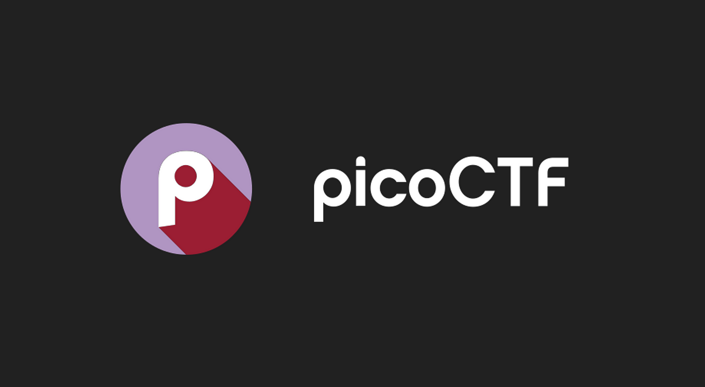
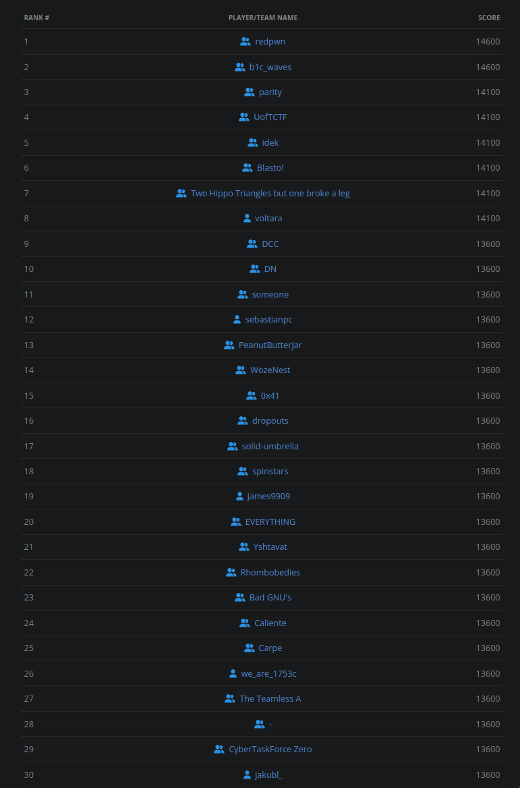

# picoCTF-2022
- https://play.picoctf.org/practice?originalEvent=70

## Description

**Registration Opens:** 6:00pm GMT+1 Feb 1, 2022

**Registration Closes:** 9:00pm GMT+2 Mar 29, 2022

**Competition Starts:** 5:00pm GMT+1 Mar 15, 2022

**Competition Ends:** 9:00pm GMT+2 Mar 29, 2022

*picoCTF 2022 is an annual capture-the-flag (CTF) hacking competition where participants gain access to a safe and unique hands on experience. Participants must reverse engineer, break, hack, decrypt, and think creatively and critically to solve the challenges and capture the flags.*

*This is a two-week long timed CTF competition. Challenges increase in difficulty as players progress. All are welcome to join but this CTF is recommended for players with some programming knowledge. Players with no previous programming or CTF experience may prefer our noncompetitive picoGym challenges.*

*All challenges will be released at the start of the competition. Point values remain the same throughout the competition. Players may participate individually or form teams of up to 5 players.*

# Results
**Username:** arch-err

**Team:** none

**Flags:** (6/65)

# Challenges
- [ ] [Local_Authority](challenges/Local_Authority)
- [x] [Inspect_HTML](challenges/Inspect_HTML)
- [ ] [Includes](challenges/Includes)
- [ ] [x-sixty-what](challenges/what)
- [x] [Vigenere](challenges/Vigenere)
- [ ] [unpackme.py](challenges/py)
- [ ] [unpackme](challenges/unpackme)
- [ ] [transposition-trial](challenges/trial)
- [ ] [Torrent_Analyze](challenges/Torrent_Analyze)
- [ ] [substitution2](challenges/substitution2)
- [ ] [substitution1](challenges/substitution1)
- [ ] [substitution0](challenges/substitution0)
- [ ] [St3g0](challenges/St3g0)
- [ ] [SQLiLite](challenges/SQLiLite)
- [ ] [SQL_Direct](challenges/SQL_Direct)
- [ ] [Sleuthkit_Intro](challenges/Sleuthkit_Intro)
- [ ] [Sleuthkit_Apprentice](challenges/Sleuthkit_Apprentice)
- [ ] [Secrets](challenges/Secrets)
- [ ] [Search_source](challenges/Search_source)
- [ ] [Safe_Opener](challenges/Safe_Opener)
- [ ] [RPS](challenges/RPS)
- [ ] [Roboto_Sans](challenges/Roboto_Sans)
- [ ] [Redaction_gone_wrong](challenges/Redaction_gone_wrong)
- [ ] [rail-fence](challenges/fence)
- [ ] [Power_Cookie](challenges/Power_Cookie)
- [ ] [patchme.py](challenges/py)
- [ ] [Packets_Primer](challenges/Packets_Primer)
- [ ] [Operation_Orchid](challenges/Operation_Orchid)
- [ ] [Operation_Oni](challenges/Operation_Oni)
- [ ] [morse-code](challenges/code)
- [ ] [Lookey_here](challenges/Lookey_here)
- [ ] [GDB_Test_Drive](challenges/GDB_Test_Drive)
- [ ] [Fresh_Java](challenges/Fresh_Java)
- [ ] [Forbidden_Paths](challenges/Forbidden_Paths)
- [ ] [flag_leak](challenges/flag_leak)
- [ ] [File_types](challenges/File_types)
- [ ] [file-run2](challenges/run2)
- [ ] [file-run1](challenges/run1)
- [ ] [Enhance!](challenges/!)
- [ ] [Eavesdrop](challenges/Eavesdrop)
- [ ] [CVE-XXXX-XXXX](challenges/XXXX)
- [ ] [credstuff](challenges/credstuff)
- [ ] [buffer_overflow_2](challenges/buffer_overflow_2)
- [ ] [buffer_overflow_1](challenges/buffer_overflow_1)
- [ ] [buffer_overflow_0](challenges/buffer_overflow_0)
- [ ] [bloat.py](challenges/py)
- [ ] [Bbbbloat](challenges/Bbbbloat)
- [ ] [basic-mod2](challenges/mod2)
- [ ] [basic-mod1](challenges/mod1)
- [ ] [basic-file-exploit](challenges/exploit)
- [ ] [Wizardlike](challenges/Wizardlike)
- [ ] [wine](challenges/wine)
- [ ] [Very_Smooth](challenges/Very_Smooth)
- [ ] [Sum-O-Primes](challenges/Primes)
- [ ] [stack_cache](challenges/stack_cache)
- [ ] [solfire](challenges/solfire)
- [ ] [SideChannel](challenges/SideChannel)
- [ ] [Sequences](challenges/Sequences)
- [ ] [ropfu](challenges/ropfu)
- [ ] [NSA_Backdoor](challenges/NSA_Backdoor)
- [ ] [noted](challenges/noted)
- [ ] [Live_Art](challenges/Live_Art)
- [ ] [Keygenme](challenges/Keygenme)
- [ ] [function_overwrite](challenges/function_overwrite)
- [ ] [buffer_overflow_3](challenges/buffer_overflow_3)
